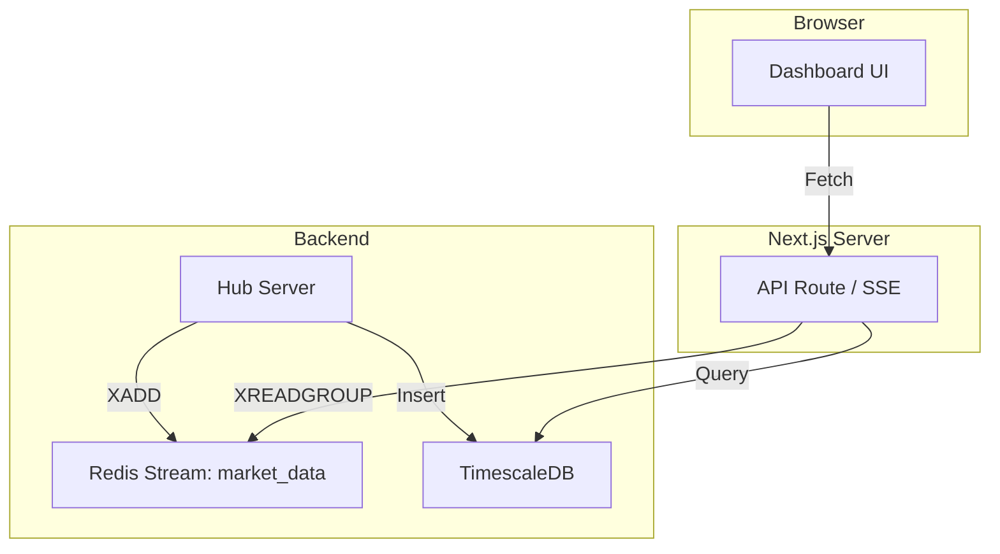

# Redis Stream Integration

## Overview

The frontend consumes market data from two primary sources to ensure a complete and real-time view:

1.  **TimescaleDB**: Historical data (Yesterday and older).
2.  **Redis Stream**: Today's data (Snapshot + Live updates).

## Data Flow

## Client Data Rule

1.  **Historical**: Fetch from TimescaleDB (up to yesterday).
2.  **Today**: Read from Redis Stream (start of day to now).
3.  **Live**: Subscribe to Redis Stream updates via SSE/WebSocket.

## Implementation Details

- **Stream Key**: `market_data`
- **Consumer Group**: Each Next.js instance/worker joins a consumer group.
- **Snapshot**: On load, fetch `bar:today:{symbol}` list for instant "today so far" chart.
